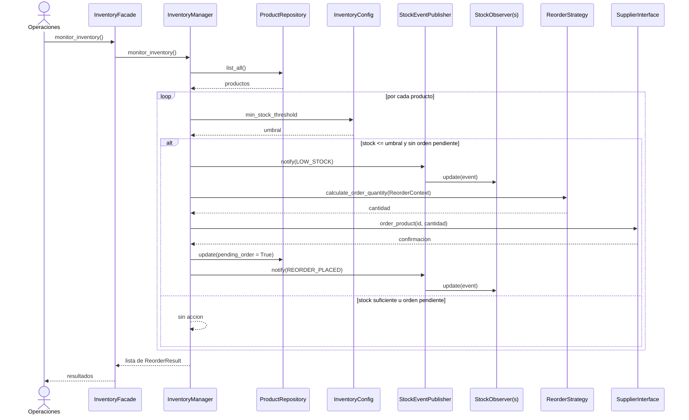
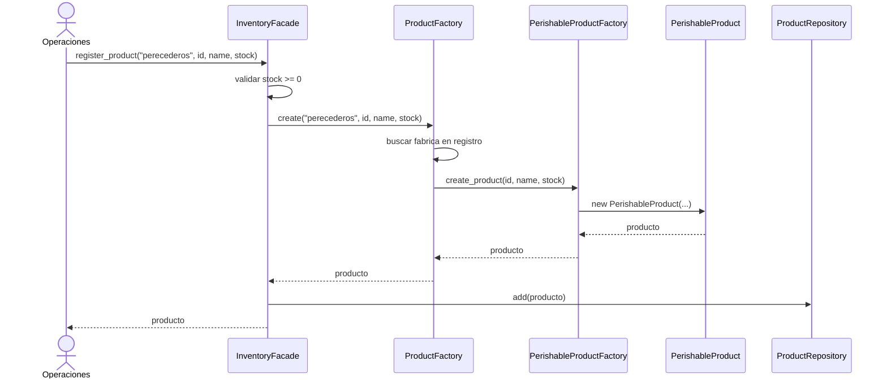
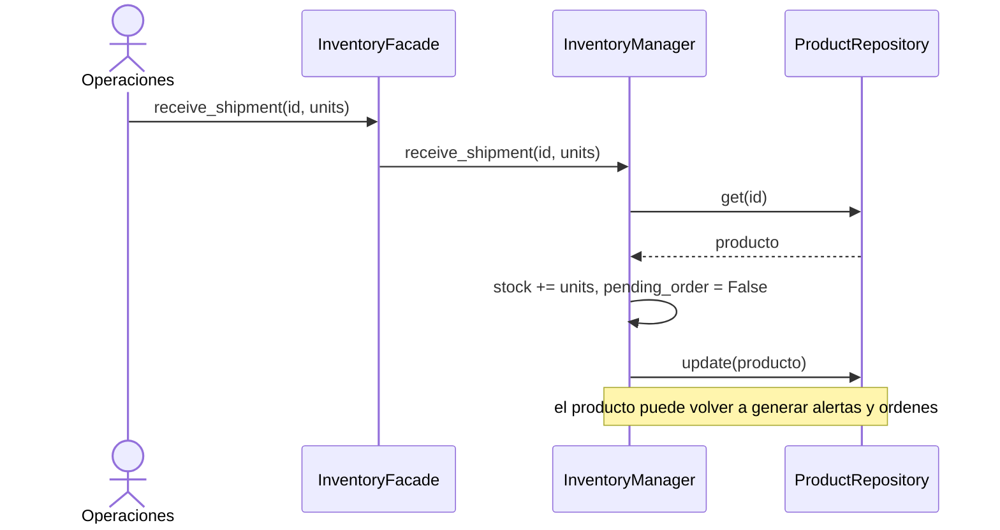

# UML - Sistema de Inventario Inteligente (Ejercicio 7)

Corresponde a `inventario_patrones.py`.

## 1. Diagrama de clases

```mermaid
classDiagram
    direction TB

    class InventoryFacade {
        <<Facade>>
        +register_product(category, id, name, stock)
        +set_min_stock_threshold(value)
        +set_reorder_strategy(strategy, category)
        +set_supplier(supplier, category)
        +set_current_month(month)
        +add_alert_channel(observer)
        +remove_alert_channel(observer)
        +record_sale(id, units)
        +receive_shipment(id, units)
        +monitor_inventory()
        +stock_report()
    }

    class InventoryConfig {
        <<Singleton>>
        -instance
        +min_stock_threshold
        +reset()
    }

    class InventoryManager {
        -current_month
        +attach(observer)
        +detach(observer)
        +set_strategy(strategy, category)
        +set_supplier(supplier, category)
        +set_current_month(month)
        +record_sale(id, units)
        +receive_shipment(id, units)
        +monitor_inventory()
        +check_product(product)
        +stock_report()
    }

    class ReorderContext {
        +product
        +threshold
        +month
    }

    class ReorderResult {
        +product_id
        +quantity
        +confirmation
        +strategy
        +supplier
    }

    class Product {
        <<abstract>>
        +product_id
        +name
        +stock
        +sales_history
        +pending_order
        +category
        +storage_requirements()*
    }
    class ElectronicProduct
    class FoodProduct
    class ClothingProduct
    class PerishableProduct
    class FrozenProduct

    class ProductFactory {
        <<abstract Creator>>
        -registry
        +create_product(id, name, stock)*
        +register(category, factory)
        +create(category, id, name, stock)
    }
    class ElectronicProductFactory
    class FoodProductFactory
    class ClothingProductFactory
    class PerishableProductFactory
    class FrozenProductFactory

    class ProductRepository {
        <<interface>>
        +add(product)*
        +get(id)*
        +update(product)*
        +delete(id)*
        +list_all()*
    }
    class InMemoryProductRepository {
        -store
    }

    class ReorderStrategy {
        <<interface>>
        +calculate_order_quantity(ctx)*
    }
    class FixedReorderStrategy {
        +quantity
    }
    class DemandBasedReorderStrategy {
        +coverage_periods
        +window
        +fallback
    }
    class SeasonalReorderStrategy {
        +base
        +peak_months
        +multiplier
    }

    class SupplierInterface {
        <<interface Target>>
        +order_product(id, amount)*
    }
    class ExternalSupplierAdapter
    class GlobalLogisticsAdapter
    class ExternalSupplierAPI {
        <<Adaptee>>
        +send_purchase_order(item_code, units)
    }
    class GlobalLogisticsAPI {
        <<Adaptee>>
        +create_order(payload)
    }

    class StockEventPublisher {
        <<Subject>>
        -observers
        +attach(observer)
        +detach(observer)
        +notify(event)
    }
    class StockEvent {
        +event_type
        +product_id
        +message
    }
    class StockObserver {
        <<interface>>
        +update(event)*
    }
    class EmailAlert
    class SMSAlert
    class SlackAlert

    InventoryFacade --> InventoryManager : delega
    InventoryFacade --> ProductRepository : registra productos
    InventoryFacade ..> ProductFactory : crea productos
    InventoryFacade --> InventoryConfig : umbral
    InventoryManager --> InventoryConfig : lee umbral
    InventoryManager --> ProductRepository
    InventoryManager --> ReorderStrategy : por categoria
    InventoryManager --> SupplierInterface : por categoria
    InventoryManager *-- StockEventPublisher
    InventoryManager ..> ReorderContext : construye
    InventoryManager ..> ReorderResult : retorna

    Product <|-- ElectronicProduct
    Product <|-- FoodProduct
    Product <|-- ClothingProduct
    Product <|-- PerishableProduct
    Product <|-- FrozenProduct

    ProductFactory <|-- ElectronicProductFactory
    ProductFactory <|-- FoodProductFactory
    ProductFactory <|-- ClothingProductFactory
    ProductFactory <|-- PerishableProductFactory
    ProductFactory <|-- FrozenProductFactory
    ProductFactory ..> Product : crea

    ProductRepository <|.. InMemoryProductRepository
    ProductRepository o-- Product : persiste

    ReorderStrategy <|.. FixedReorderStrategy
    ReorderStrategy <|.. DemandBasedReorderStrategy
    ReorderStrategy <|.. SeasonalReorderStrategy
    SeasonalReorderStrategy o-- ReorderStrategy : base
    ReorderStrategy ..> ReorderContext : usa

    SupplierInterface <|.. ExternalSupplierAdapter
    SupplierInterface <|.. GlobalLogisticsAdapter
    ExternalSupplierAdapter --> ExternalSupplierAPI : adapta
    GlobalLogisticsAdapter --> GlobalLogisticsAPI : adapta

    StockEventPublisher o-- StockObserver
    StockEventPublisher ..> StockEvent : publica
    StockObserver <|.. EmailAlert
    StockObserver <|.. SMSAlert
    StockObserver <|.. SlackAlert
    StockObserver ..> StockEvent : recibe
```

## 2. Patrones sobre el diagrama

| Patrón | Participantes |
|---|---|
| Singleton | `InventoryConfig` |
| Factory Method | Creator `ProductFactory`; concretos `*ProductFactory`; producto `Product` y subclases |
| Repository | `ProductRepository`, `InMemoryProductRepository` |
| Strategy | Contexto `InventoryManager`; estrategias `Fixed`, `DemandBased`, `Seasonal` |
| Adapter | Target `SupplierInterface`; adaptadores `ExternalSupplierAdapter`, `GlobalLogisticsAdapter`; adaptados `ExternalSupplierAPI`, `GlobalLogisticsAPI` |
| Observer | Subject `StockEventPublisher` (usado por `InventoryManager`); observers `EmailAlert`, `SMSAlert`, `SlackAlert` |
| Facade | `InventoryFacade` |

## 3. Secuencia: `monitor_inventory()` (producto con stock bajo)

## 4. Secuencia: `register_product()` (Factory Method + Repository)

## 5. Secuencia: cierre del ciclo de reposición

